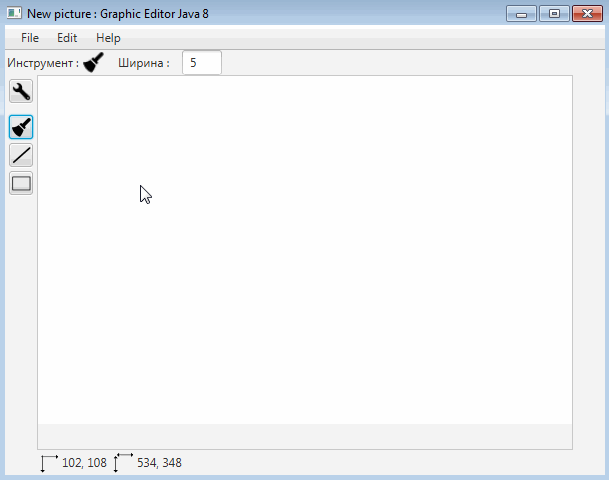
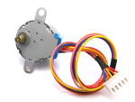



# Графический редактор на Java + проект Arduino

###Текущее состояние проекта:
- отображение координат мыши, размера картинки
- изменение ширины линии
- Инструменты: Кисть, Линия, Прямоугольник, режим редактирования
- Кэш объектов
- Отмена действий над объектами

##Описание
Приложение для создания и обработки двумерных графических изображений.

Сохранение и загрузка файлов,

Минимальный набор инструментов для рисования:
- кисть,
- простые фигуры: прямые линия, прямоугольник,
- инструмент редактирования объектов.

##Дополнительно
  Построитель плоской карты окружения на Arduino, его основные части: 
  - плата Arduino                                    
  - ультразвуковой дальномер (возвращает расстояние) 
  - шаговый двигатель (возвращает угол поворота оси) 
  
Эти два параметра (расстояние и угол поворота оси двигателя) записываются в текстовый файл, который используется графическим редактором для построения плоской карты (вид сверху), например, комнаты.
Вид сверху:

"Ar" - устройство на Arduino.

##В будущем
  - Модернизация устройства на Arduino для реализации трехмерной карты окружения,
  - Добавление возможности работать с 3d графикой в редакторе.
