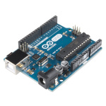
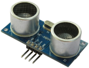
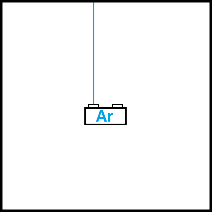

# Графический редактор на Java + проект Arduino
##Описание
Приложение для создания и обработки двумерных графических изображений.

Сохранение и загрузка файлов,

Минимальный набор инструментов для рисования:
- кисть,
- ластик,
- заливка,
- палитра цветов,
- простые фигуры: прямые линии, эллипсы, прямоугольники и т.д.

##Дополнительно
  Построитель плоской карты окружения на Arduino, его основные части: 
  - плата Arduino                                    
  - ультразвуковой дальномер (возвращает расстояние) 
  - шаговый двигатель (возвращает угол поворота оси) 
  
Эти два параметра (расстояние и угол поворота оси двигателя), записываются в текстовый файл, который используется графическим редактором для построения плоской карты (вид сверху), например, комнаты.
Вид сверху:

"Ar" - устройство на Arduino.

##В будущем
  - Модернизация устройства на Arduino для реализации трехмерной карты окружения,
  - Добавление возможности работать с 3d графикой в редакторе.
