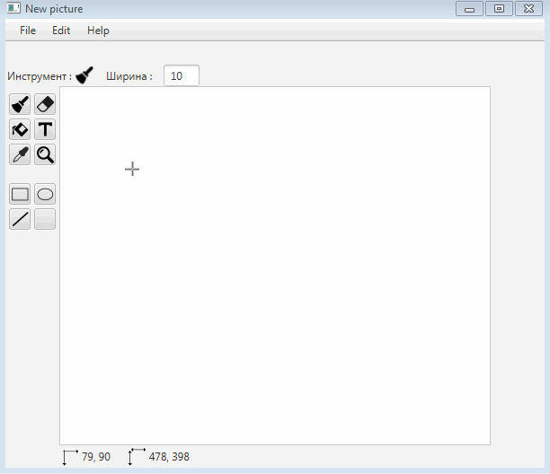

# Графический редактор на Java + проект Arduino

###Текущее состояние проекта:
- при выборе инструмента изменяется курсор и иконка на панели инструментов
- отображение координат мыши, размера картинки
- Кисть V0.1
- Ластик V0.1
- изменение ширины кисти
- рисование кистью создает отдельные объекты на доске
- ДОБАВЛЕНО: объекты, созданные кистью, можно удалять:

##Описание
Приложение для создания и обработки двумерных графических изображений.

Сохранение и загрузка файлов,

Минимальный набор инструментов для рисования:
- кисть,
- ластик,
- заливка,
- палитра цветов,
- простые фигуры: прямые линии, эллипсы, прямоугольники и т.д.

##Дополнительно
  Построитель плоской карты окружения на Arduino, его основные части: 
  - плата Arduino                                    
  - ультразвуковой дальномер (возвращает расстояние) 
  - шаговый двигатель (возвращает угол поворота оси) 
  
Эти два параметра (расстояние и угол поворота оси двигателя) записываются в текстовый файл, который используется графическим редактором для построения плоской карты (вид сверху), например, комнаты.
Вид сверху:

"Ar" - устройство на Arduino.

##В будущем
  - Модернизация устройства на Arduino для реализации трехмерной карты окружения,
  - Добавление возможности работать с 3d графикой в редакторе.
